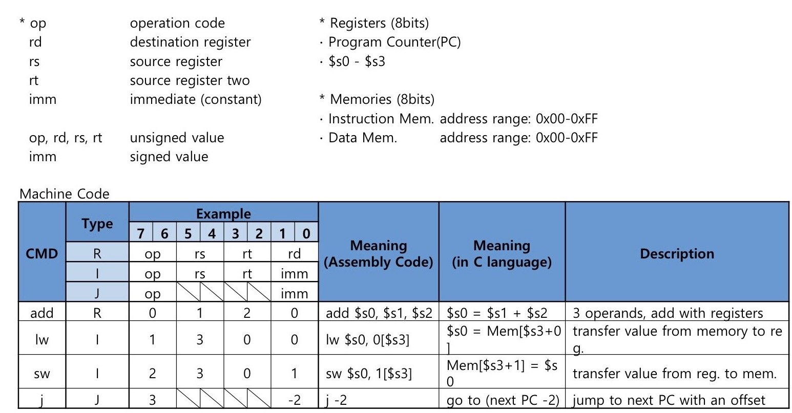

# Tiny Microprocessor
* [Project Overview](README.md#project-overview)
* [Modules and Code Structure](README.md#modules-and-code-structure)
* [Microprocessor Design](README.md#microprocessor-design)
    * [Data Path](README.md#data-path)
    * [Instruction Set Architecture](README.md#instruction-set-architecture)
        * [Formats of the entire instruction set](README.md#formats-of-the-entire-instruction-set)
        * [Control Signals](README.md#control-signals)
    * [Interface of Microprocessor components](README.md#interface-of-microprocessor-components)
* [Verilog Testbench and Simulation](README.md#verilog-testbench-and-simulation)
* [Simulation and Testing](README.md#simulation-and-testing)

## Project Overview
A Verilog implementation of a Simple Microprocessor programmed on an FPGA board.
* **Clock** : Clocks are generated from on-board 50Hz oscillator. Provided clock speeds are *1Hz (Base clock), 0.5Hz* and *0.25 Hz*. Frequency selectors are used to switch to the lower frequencies.
* **Specification** : 8-bit Microprocessor
  * Instruction size : 8-bit
  * Instruction Set : 4 (add, load, store, jump)
  * Register size : 8-bit
  * Number of registers : 4
  * Memory size : 8-bit word size, 8-bit memory address, 32 memory address locations
* **Input** :
   * 8-bit `instruction` from external memory
   * `reset` button
   * 0.25Hz and 0.5Hz frequency selectors: `frequency_4` and `frequency_2`
* **Output** :
   * Current value of `RegWriteData` in Hexadecimal
   * Register to which `RegWriteData` is written
   * Value of `pc` i.e *next instruction to be executed*
   * Value of `MemRead`, `MemWrite`, `RegWrite`, `op` and `clock`
## Modules and Code Structure
* **Microprocessor** :
   * The ALU, control unit, system memory, frequency divider, pc and registers are condensed into a behavioural description of `Microprocessor` module. This module is responsible for all the external inputs and output and forms the core part of the project.
   ```verilog
   module Microprocessor(
    output clock,
    output mem_write,
    output mem_read,
    output reg_write,
    output [1:0]op,
    output [6:0]reg_num,
    output [6:0]pc_high,
    output [6:0]pc_low,
    output [7:0]instruction_address,
    output [6:0]rwd_1,
    output [6:0]rwd_0,
    output [1:0]r_symbol,
    input frequency_2,
    input frequency_4,
    input oscillator,
    input reset,
    input [7:0]instruction
    );
   ```
   * Clock for the processor is obtained using an embedded `frequency divider` which uses a delay technique to generate parallel slower clocks. Furthermore, a desired clock is selected based on the frequency input values.
   ```verilog
  //Frequency divider section
    reg [25:0] delay;
    reg delay_2;
    reg delay_4;
    reg sec;
    reg two_sec;
    reg four_sec;

    always @(posedge oscillator)begin
    	delay  <= (delay == 25000000)?26'd0:(delay+1);
    	if (delay == 26'd0)begin
    		sec <= ~sec;
    	end
    end

    always @ ( posedge sec ) begin
      two_sec <= ~two_sec;
    end

    always @ ( posedge two_sec ) begin
      four_sec <= ~four_sec;
    end

    assign clock = frequency_4 ? four_sec:
                    frequency_2 ? two_sec :
                    sec;
   ```
   * The main part of the sequential circuit description is an always block that is triggered by the positive edge of the `clock` and an asynchronous `reset` input .The latter asynchronously resets the registers, memory and the pc to their default values when asserted.
   ```verilog
   always @ (posedge clock or posedge reset) begin

   if (reset) begin
   ... //Reinitialize memory, registers and pc
   end

   else begin
   ...//Instruction execution, calculate new PC value and update of the output register
   end

   end
   ```
   * The storage elements in the project are implemented using the `reg` type variable.
   ```verilog
   //Memory and Registers section
    reg [7:0]registers[3:0];
    reg [7:0]pc;
    reg [7:0]memory[31:0];
   ```
   * Bus connections and convenience storage elements.
   ```verilog
  //Output convenience registers
    reg [4:0]rw_num;
    reg [1:0]op_out;
    reg data_invalid;
    reg reg_invalid;

    //buses
    wire [7:0]immediate;
    wire [7:0]display_bus = registers[rw_num];
   ```
   ```verilog
    //connections
    assign instruction_address = pc;
    assign immediate = {instruction[1],instruction[1],instruction[1],
                        instruction[1],instruction[1],instruction[1],
                        instruction[1],instruction[0]}; //signext
    assign mem_write = (op == 2'b10);
    assign mem_read = (op == 2'b01);
    assign reg_write = ~op[1];
    assign op = op_out;
    assign r_symbol = 2'b11;
   ```
* **Console** :
   * `Console` module is a 4-bit Hexadecimal to 7-segment display converter. This module is a data-flow style description that asserts or deasserts 7 output wires based on the values of 4 input lines. It forms a part of the `Microprocessor` module where it encoded Hexadecimal output to 7-segment display to provide user with external output.
   ```verilog
   odule Console(
    output [6:0]sseg,
    input [3:0]hex,
	 input n_valid //Generate "-" invalid input indicator
    );
   ```
   ```verilog
   //7-segment display
   Console data1(rwd_1, display_bus[7:4],data_invalid);
   Console data0(rwd_0, display_bus[3:0],data_invalid);
   Console  pc_counter_high(pc_high, pc[7:4],1'b0);
   Console  pc_counter_low(pc_low, pc[3:0], 1'b0);
   Console reg_num_(reg_num, rw_num,reg_invalid);
   ```
* **IMEM** :
   * `IMEM` module is a write once read many times instruction memory. It gets an 8-bit instruction address and returns an 8-bit machine instruction code.
   ```verilog
   module IMEM(
    output [7:0] instruction,
    input [7:0] Read_Address
    );
   ```
## Microprocessor Design
### Data Path

### Instruction Set Architecture

#### Formats of the entire instruction set
#### Control Signals
* Most of the control signals in the Microprocessor design were not explicitly implemented in the behavioral description model as they are automatically generated in the conditional blocks and in the use of appropriate variables.
* `MemRead`, `MemWrite`, `RegWrite` and `op` are explicitly defined to provide handy output signals for the user.
### Interface of Microprocessor components
* **Program Counter** :
   * Indicates the address of the instructions. Initial PC value is 0.
* **Registers** :
   * There are four 8-bit general purpose registers.
   * Every time `RegWrite` is asserted, the corresponding register and it's new value (`RegWriteData`) is displayed.
* **Instruction Memory**
   * Contains pre-defined instructions (defined in the ISA).
   * Implemented on separate FPGA board and connected through two 8-bit buses.
* **Control Unit**
   * Send appropriate control signals depending on the 2-bit op code.
* **ALU**
   * Performs addition arithmetic.
* **Data Memory**
   * 8-bit address i.e 256 adress locations but only 32 address locations are used.
   * Initial values are: `[0]0, [1]1, ... , [15]15, [16]0, [17]-1, ... ,[31]-15`
* **Output 7-segment Display**
   * Two segment displays the contents of the Register for `RegWriteData` in hexadecimal. Additional output LEDs and displays are used for additional outputs.

## Simulation and Testing
* The following code shows part of the test bench  fixture code used to simulate and verify the Microprocessor. I temporarily readjusted `clock` to directly reflect the value of `oscillator` for convenience during the simulation.
```verilog
	initial begin
		oscillator = 0;
	end
	always #10 oscillator = ~oscillator;

	initial begin
		// Initialize Inputs
		frequency_2 = 0;
		frequency_4 = 0;
		reset = 1;
		// Wait 100 ns for global reset to finish
		#15 reset = 0;
		// lw $s2, 1($s0)
		instruction  = {2'b01, 2'b00, 2'b10, 2'b01};
   		// j + 1
   		#20 instruction = {2'b11, 2'b00, 2'b00, 2'b01};
   		// add $s0, $s1 $s2
   		#20 instruction = {2'b00, 2'b01, 2'b10, 2'b00};
   		// sw $s2, 1($s2)
   		#20 instruction  = {2'b10, 2'b10, 2'b10, 2'b01};
   		// lw $s3, 1($s0)
   		#20 instruction = {2'b01, 2'b01, 2'b11, 2'b01};
	end
```
* Simulation results.

* FPGA board implememtation results.

